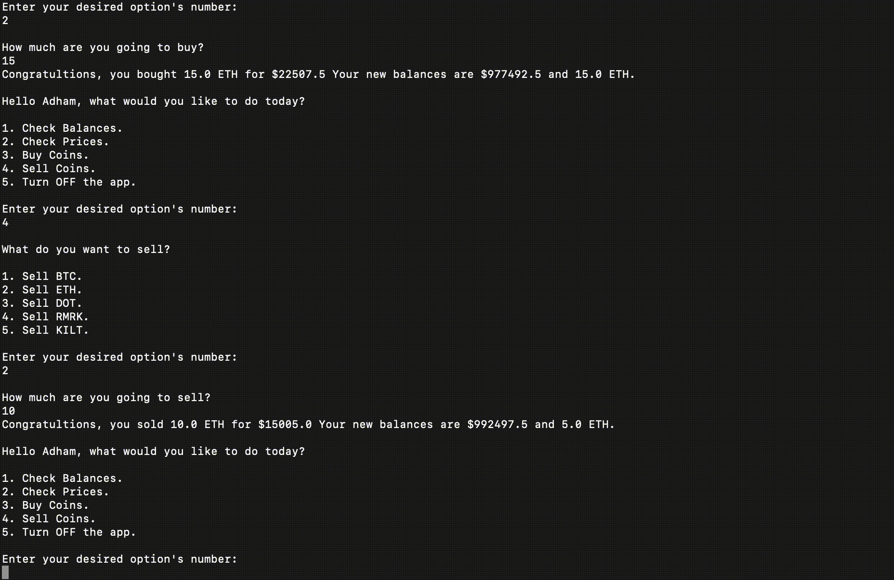
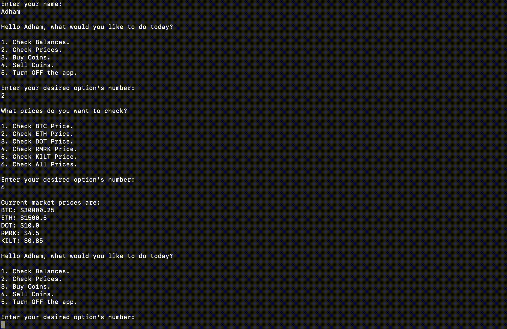
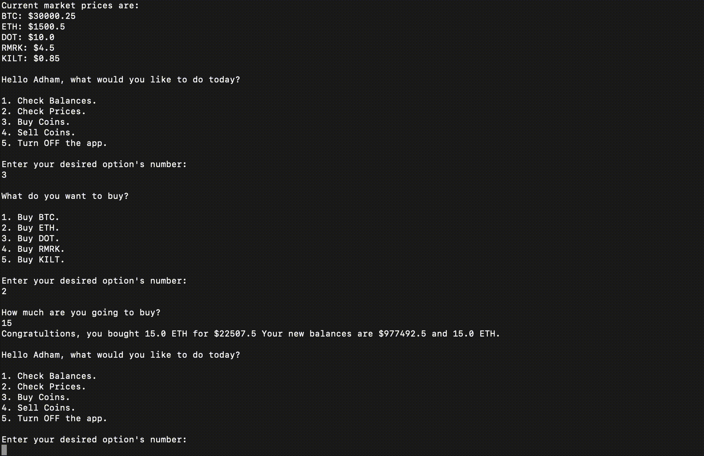
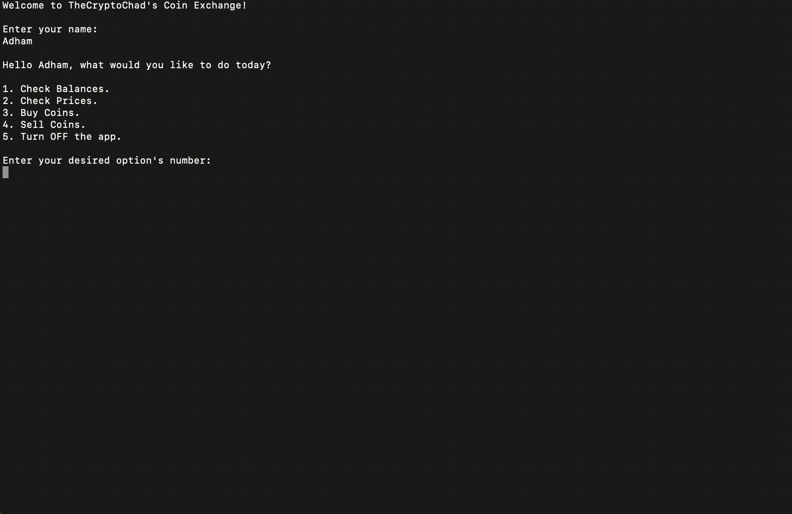

# CryptoExchange
The following Java app is intented to simulate the main functionalities of a Cryptocurrency Exchange. To do so, the user is able to enter their name, check balances, check prices, buy coins, sell coins, or choose when to turn off the app.

## Prerequisite

- [Java](https://www.oracle.com/java/technologies/downloads/)

## Installation

In order to run this app locally you must first clone the repository with:
```sh
git clone https://github.com/TheCryptoChad/CryptoExchange.git
```
You can then open the project folder in an IDE like [Eclipse](https://www.eclipse.org/ide/) and run it. 

Otherwise, if you're looking to run the app locally, you should move all the `.class` file from the `/bin` folder into the `/src` folder.

Finally, navigate inside the directory and run the app with:
```sh
java Exchange
```

## Features

### Checking Balances

The app is capable of checking different balances for the user, individually or all at once. These update while the user makes transactions.



### Checking Prices

The app is capable of checking different prices for the user, individually or all at once. Prices are static for the sake of this program.


### Buying Coins

The app is capable of buying different coins for the user as long as they have enough funds. The transaction will update the balances for both coins and display those updated balances.



### Selling Coins

The app is capable of selling different coins for the user as long as they have enough funds. The transaction will update the balances for both coins and display those updated balances.



### Insufficient Funds

The app is capable of recognizing if the user doesn't have enough funds to buy or sell a coin. Should that be the case, the app will throw back an error message.


